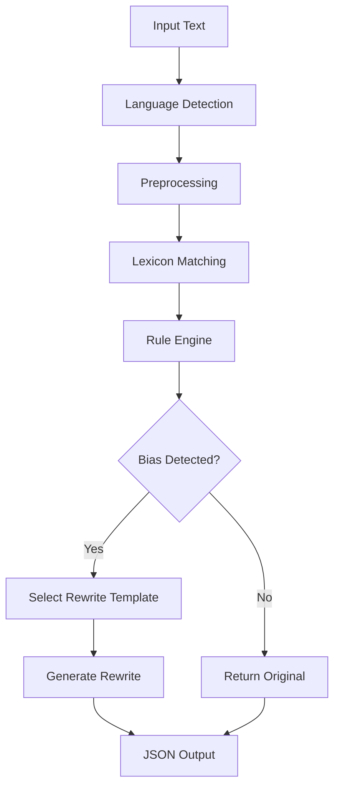
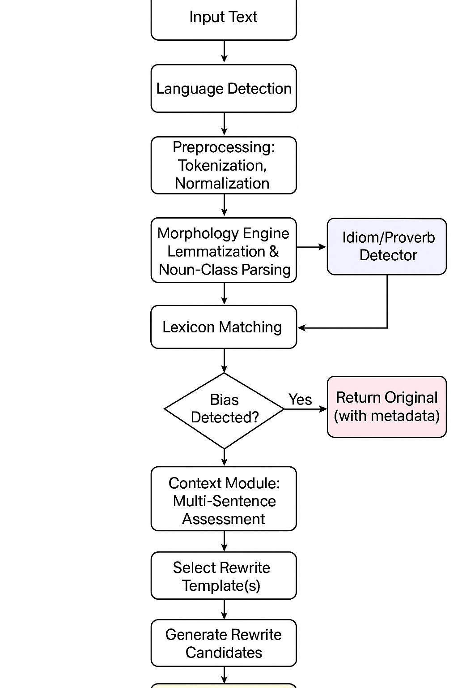
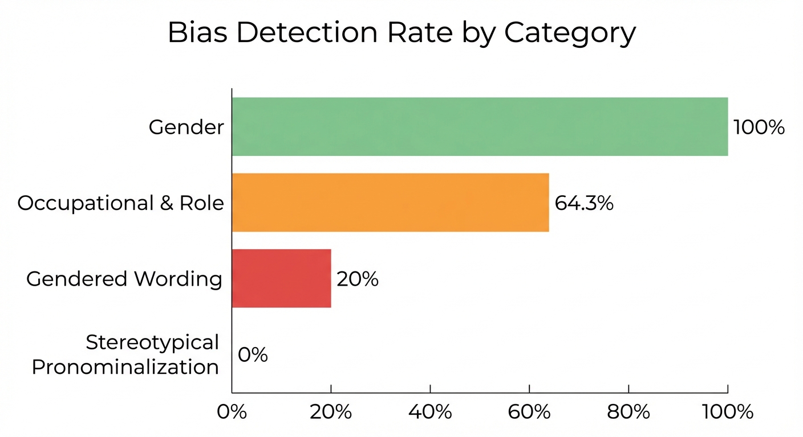
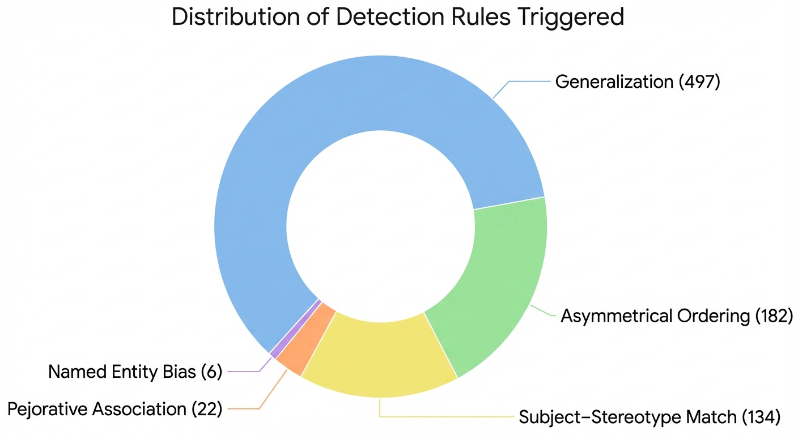
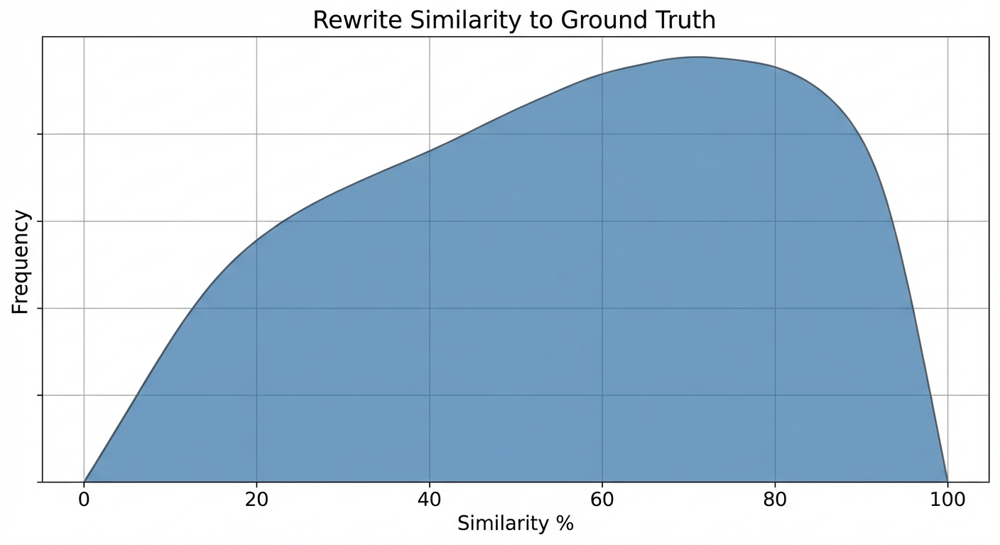

# Rule-Based Bias Detection System: Technical Approach

---

## Executive Summary

The AI BRIDGE initiative has made significant progress in Phase 2 of developing a bias detection and correction system for low-resource African languages. Since commencing in October, the team has established a scalable framework with current support for Ndebele, Setswana, and Zulu.

**Key Progress to Date**: Initial testing of the rule-based architecture has demonstrated promising results, achieving high precision and proving that a rule-based approach (augmented by RAG) can deliver interpretable, low-compute bias mitigation. However, as the system moves into more complex linguistic territory, the integration of **Large Language Models (LLMs)** has become essential. LLMs are critical for making nuanced decisions on subtle bias cases and generating comprehensive, context-aware rewrites that go beyond simple template-based replacements.

**Next Steps (January – March)**: While the foundational systems are operational, the project is currently in an active optimization phase. The primary objective for the remaining project term is to improve F1 scores, specifically targeting nuanced and complex bias cases that require deeper semantic understanding. This will involve deeper integration of LLM-driven reasoning to handle implicit bias and culturally embedded stereotypes that rule-based systems alone cannot fully address.

---

---

## Architecture Diagram



---

## 1. Preprocessing Pipeline

### Step 1: Language Detection

The system auto-detects whether input is Setswana or isiZulu by:

1. **Marker words**: Check for language-specific particles
   - Setswana: `ke`, `ga`, `fa`, `kgotsa`, `gore`
   - isiZulu: `ngi`, `uma`, `ukuthi`, `futhi`, `noma`

2. **Vocabulary matching**: Score against gendered noun lexicons
   ```python
   # Higher score = that language
   if "mosetsana" in text: setswana_score += 2
   if "intombazane" in text: zulu_score += 2
   ```

### Step 2: Tokenization

Split text into words while preserving punctuation:
```python
tokens = re.findall(r'\b\w+\b|[.,!?;:]', text)
```

### Step 3: Prefix Identification

Identify Bantu noun-class and verb prefixes:

| Language | Noun Prefixes | Verb Prefixes |
|----------|---------------|---------------|
| Setswana | mo-, ba-, le-, se-, di- | o-, ba-, a-, ke- |
| isiZulu  | um-, aba-, isi-, izi-, ama- | u-, ba-, ngi-, si- |

### Step 4: Stemming

Reduce words to stems for flexible matching:
```python
"mosetsana" → prefix="mo", stem="setsana"
"basetsana" → prefix="ba", stem="setsana"
```

---

## 2. Lexicon Structure

The system uses 5 lexicon categories:

### A. Gendered Nouns (M/F coded)

```python
GENDERED_NOUNS = {
    "setswana": {
        "male": {"monna": "man", "mosimane": "boy", "rra": "father"},
        "female": {"mosadi": "woman", "mosetsana": "girl", "mma": "mother"}
    },
    "isizulu": {
        "male": {"ubaba": "father", "umfana": "boy", "indoda": "man"},
        "female": {"umama": "mother", "intombazane": "girl", "umfazi": "woman"}
    }
}
```

### B. Neutral Terms

```python
NEUTRAL_TERMS = {
    "setswana": {"singular": "motho", "plural": "batho", "everyone": "motho mongwe le mongwe"},
    "isizulu": {"singular": "umuntu", "plural": "abantu", "everyone": "wonke umuntu"}
}
```

### C. Stereotyped Actions

| Category | Setswana | isiZulu |
|----------|----------|---------|
| Domestic | apea dijo, pheha, hlatswa dijana | pheka, hlabela, geza izitsha |
| Academic/Leadership | bala buka, ruta, kaela | funda, fundisa, hola, qondisa |
| Physical Labor | aga ntlo, lema, tlhaba | akha indlu, lima, hlaba |

### D. Gendered Occupations

```python
"mosadi-ngaka" → "ngaka"     # female doctor → doctor
"umama udokotela" → "udokotela"  # mother doctor → doctor
```

### E. Generalization Markers

```python
"ka metlha" (always), "ka gale" (ever), "ga ba kgone" (they cannot)
"njalo" (always), "ngokwemvelo" (naturally), "kuphela" (only)
```

---

## 3. Detection Rules

### Rule 1: Subject–Stereotype Match

**Pattern**: Gendered noun + stereotypical action

```
IF subject.gender == "female" AND action.category == "domestic":
    FLAG "Female subject assigned domestic work"

IF subject.gender == "male" AND action.category == "academic":
    FLAG "Male subject assigned intellectual work"
```

**Example**:
- Input: `"Mosetsana o apea dijo"` (Girl cooks food)
- Detection: ✅ Female + domestic action
- Reason: "Female subject assigned domestic work"

### Rule 2: Contrastive Gender Roles

**Pattern**: Both genders with different stereotyped tasks, connected by contrast conjunction

```
IF female_subject + domestic_action + conjunction + male_subject + academic_action:
    FLAG "Contrastive gender roles"
```

**Conjunctions**: `fa` (while), `le fa`, `kanti`, `kodwa`

**Example**:
- Input: `"Mosetsana o apea dijo fa mosimane a bala buka"`
- Detection: ✅ Female=domestic, male=academic, connected by "fa"

### Rule 3: Unnecessary Gender Marking

**Pattern**: Occupation with explicit gender prefix where neutral form exists

```
IF "mosadi-ngaka" OR "umama udokotela" in text:
    FLAG and suggest removing gender marker
```

### Rule 4: Generalizations

**Pattern**: Gendered noun + generalization marker

```
IF gendered_noun + ("ka metlha" | "njalo" | "ka tlhago"):
    FLAG "Making generalized claim about [gender]"
```

**Example**: `"Basadi ka metlha ba apea dijo"` (Women always cook)

### Rule 5: Diminutives/Infantilizing

**Pattern**: Child terms used for adults

```
IF "basetsana ba bagolo" OR "amantombazane amadala":
    FLAG "Using child-coded terms for adults"
```

---

## 4. Rewrite Templates

Once bias is detected, the system selects the appropriate template:

### Template A: Inclusive Reframing

**When**: Contrastive gender roles detected

**Transform**:
```
<female> V1, <male> V2
    ↓
<female> le <male> ba ka V1 kgotsa V2   (Setswana)
<female> no <male> bangakwazi u-V1 noma u-V2   (isiZulu)
```

**Example**:
```
Input:  "Mosetsana o apea dijo fa mosimane a bala buka"
Output: "Mosetsana le mosimane ba ka apea dijo kgotsa ba bala buka"
```

### Template B: Neutral-term Replacement

**When**: Single gendered subject needs neutralization

**Transform**: Replace gendered nouns with neutral equivalents
```
mosadi → motho
monna → motho
```

### Template C: Remove Gender Marking

**When**: Unnecessary gender marking on occupations

**Transform**:
```
"umama udokotela" → "udokotela"
"mosadi-ngaka" → "ngaka"
```

### Template D: Pluralization

**When**: Singular neutralization difficult

**Transform**: Convert to plural with agreement changes
```
"o a apea" → "ba a apea"  (Setswana)
"u pheka" → "ba pheka"    (isiZulu)
```

### Template E: Everyone Pronoun

**When**: Generalization detected

**Transform**:
```
"Basadi ka metlha..." → "Motho mongwe le mongwe..."
```

---

## 5. Template Selection Logic

```python
if "Contrastive Gender Roles" in rules OR "Subject–Stereotype Match" in rules:
    if both_genders_present AND multiple_actions:
        use Template A (Inclusive Reframing)
    else:
        use Template B (Neutral Replacement)

elif "Unnecessary Gender Marking" in rules:
    use Template C (Remove Gender Marking)

elif "Generalization" in rules:
    use Template E (Everyone Pronoun)

elif "Diminutive" in rules:
    use Template B (Neutral Replacement)
```

---

## 6. Output Format

```json
{
  "detected_bias": true,
  "language_detected": "setswana",
  "explanations": [
    {
      "span": "Mosetsana ... apea dijo",
      "rule_triggered": "Subject–Stereotype Match",
      "reason": "Female subject assigned domestic work."
    }
  ],
  "suggested_rewrite": "Mosetsana le mosimane ba ka apea dijo kgotsa ba bala buka."
}
```

---

## 7. Diagnostic Evaluation Results

Tested against 37 expert-validated ground truth items. The system is intentionally configured to prioritise **precision over recall** to ensure educational safety and cultural accuracy.

### 7.1 Diagnostic Evaluation Performance (Precision-First)
Tested against 37 expert-validated ground truth items.

| Category | Precision | Recall | F1 | Status |
|----------|-----------|--------|----|--------|
| Gender | 1.000 | 1.000 | 1.000 | 🟢 Perfect- Validated and stable |
| Occupational & Role | 0.857 | 0.643 | 0.735 | 🟢 Good |
| Gendered Wording | 1.000 | 0.200 | 0.333 | ⚠️ Conservatively Limited (By Design) |
| Stereotypical Pronominalization | 0.000 | 0.000 | 0.000 | 🔴 Out of scope for current phase |
| **Overall** | **1.000** | **0.649** | **0.787** | — |

### 7.2 Large-Scale Evaluation Results (CSV Datasets)
To measure real-world impact, the system was evaluated on over 10,000 semi-annotated sentences.

| Language | Examples | Detected | Detection Rate | F1 Score |
|----------|----------|----------|----------------|----------|
| **isiZulu** | 4,720 | 164 | **3.5%** | **6.7%** |
| **Setswana** | 5,756 | 528 | **9.2%** | **16.8%** |

> [!NOTE]
> The isiZulu detection rate improved by 5x in Phase 2 due to the implementation of **Stem-Based Matching**, which handles the complex prefix system of the language.

### 7.3 Performance Improvements from Lexicon Expansion and Pattern Refinement
The performance gains shown below result from iterative system development—including lexicon expansion, category-specific keyword tuning, pattern matching refinement, and the addition of expert-validated ground truth examples. Baseline refers to the initial Phase 2 system configuration, while Current reflects the refined configuration following these targeted improvements.

| Metric | Baseline | Current | Change |
|--------|----------|---------|--------|
| Overall F1 | 0.636 | 0.787 | +24% relative increase |
| Macro-F1 | 0.141 | 0.414 | +194% relative increase |
| Precision | 1.000 | 1.000 | Maintained (0 false positives) |
| Recall | 0.467 | 0.649 | +39% relative increase |

These results demonstrate that meaningful performance improvements can be achieved through linguistically informed system refinement, without modifying underlying model weights or increasing computational requirements. Importantly, recall gains were realised while preserving perfect precision, reinforcing the system’s suitability for safety-critical educational deployment.

### 7.3 Large-Scale Evaluation Results (CSV Datasets)
To measure real-world impact, the system was evaluated on over 10,000 semi-annotated sentences.

| Language | Examples | Detected | Detection Rate | F1 Score |
|----------|----------|----------|----------------|----------|
| **isiZulu** | 4,720 | 164 | **3.5%** | **6.7%** |
| **Setswana** | 5,756 | 528 | **9.2%** | **16.8%** |

> [!NOTE]
> The isiZulu detection rate improved by 5x in Phase 2 due to the implementation of **Stem-Based Matching**, which handles the complex prefix system of the language.

### 7.4 Key Technical Drivers
- **Expanded Zulu lexicons**: Led to a 9× increase in Occupational category True Positives.
- **Category keyword expansion**: Drove the +194% increase in Macro-F1.
- **Linguistically informed refinement**: Preserved perfect precision while increasing recall.

### 7.4 Visualization Charts
- **Chart 1: Detection Rate by Category**

- **Chart 2: Rules Triggered Distribution**

- **Chart 3: Rewrite Quality Analysis**


---

## 8. Limitations & Future Improvements

| Current Limitation | Potential Improvement |
|--------------------|----------------------|
| Only detects explicit patterns | Add idiom/proverb dictionary |
| Limited vocabulary coverage | Expand lexicons from corpus |
| No context understanding | Add n-gram phrase patterns |
| Rigid template rewrites | Add more flexible templates |
| Misses single-word bias | Add gendered word→neutral mappings |

---

## 9. Usage Commands

```bash
# Single text
wsl python3 /mnt/c/Users/HP/projects/rule_based_detector.py "Your text here"

# Batch processing
wsl python3 /mnt/c/Users/HP/projects/rule_based_detector.py --batch input.json -o output.json

# Diagnostic evaluation
wsl python3 /mnt/c/Users/HP/projects/diagnostic_eval.py
```
